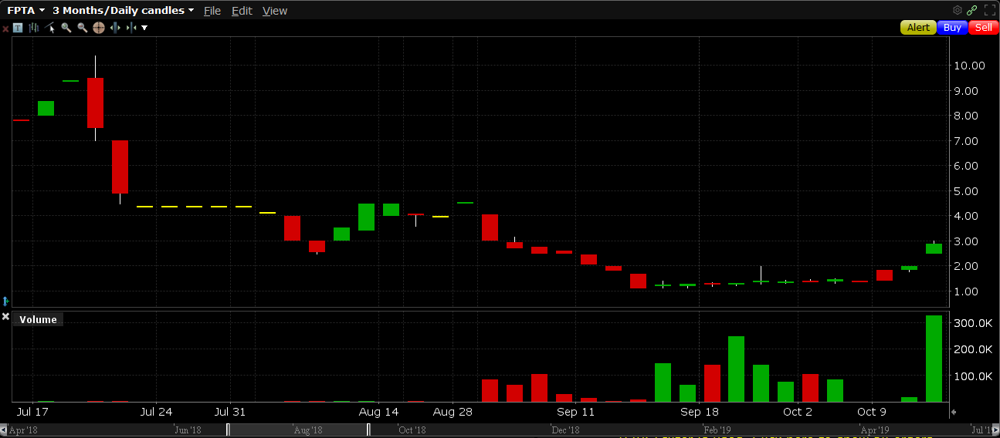
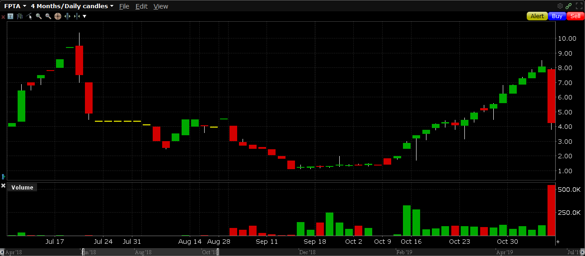
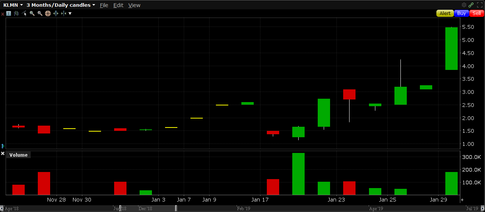
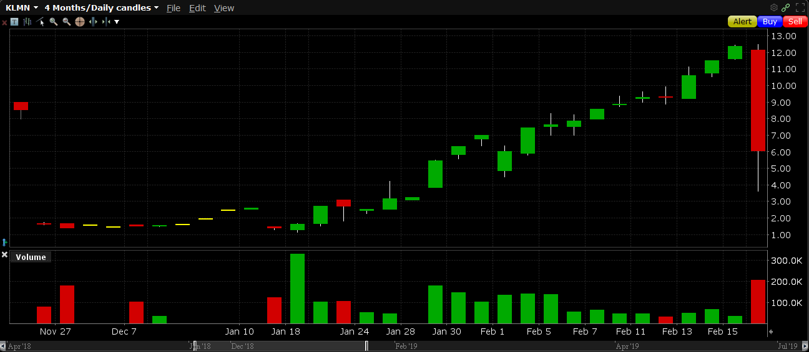

# Penny
OTC Market "pump and dump" identifying system for penny stocks.

Penny takes live OTC market data and uses a machine learning classifier to filter which stock symbols show signs of stock manipulation and stock promotion.
Penny is engineered to identify pump and dumps on the first day of the stock promotion and price manipulation.
Penny uses a model trained on verified examples of pump and dump stocks and typical non-manipulated instances of active OTC stocks.
Penny is intended to be ran daily at any point during market hours on OTC data to identify potential cases of stock promotion.

### Classification in Practice
On live OTC market data, Penny has performed extremely well in practice.
Penny has already exhibited perfect recall and great precision on real OTC market data.
Starting in September 2018, Penny has correctly classified all "tier 1" pump and dumps which occurred on the first day of the promotions.
Two instances are shown below with stocks FPTA and KLMN.

FPTA - First day of promotion chart (correctly identified 10/15/2018)

FPTA - Full stock promotion chart that followed

KLMN - First day of promotion chart (correctly identified 1/29/2019)

KLMN - Full stock promotion chart that followed

### Usage
Example usage:

`java -jar penny.jar --live -mostactive`

`java -jar penny.jar --spoof -parallel`

`java -jar penny.jar --analyze 1/16/2016 BRAB JYON DAVD EMIT -csv data.csv`

Usage:
Penny can be run with a number of different major command-line arguments (--major) and combined with unique minor command-line arguments (-minor):

`--live`
Runs Penny on live market data configured with an existing broker (Interactive Brokers).
*Requires a real-time level 1 OTC market data subscription to operate.*
Outputs positive classified instances of stock tickers considered to be on the first day of a pump and dump stock promotion.
    `-mostactive`
    Scans and classifies only the top 50 most active OTC stocks based on daily dollar volume as opposed to the entire OTC market.
    Offers significant speedup on results.  Furthermore, this option offers superior precision on results as the dataset which the ML classifier was trained on is best suited for stocks that already exhibit substantial activity.
    `-log <output_file>`
    Outputs classified stock tickers to the file specified.
    `-serialize`
    Serializes all scanned stocks and their tick values to the constant database directory location (see `SerializationConstants.java`).

`--analyze <mm/dd/yyyy> <ticker1> <ticker2> <...>`
Analyzes previously serialized stock market data allowing for dataset expansion, and historical classification testing.
Loads data from the constant database directory location (see `SerializationConstants.java`) based on the date provided.
Takes in a variable number of stock tickers to analyze specifically.
If no tickers are specified, analyzes all previously serialized tickers from that day.
    `-csv <output_file>`
    Appends the analyzed stocks and data to the output file specified in CSV format.

`--spoof`
Runs Penny on simulated market data for demonstration.
Outputs positive classified (fake) instances of stock tickers considered to be on the first day of a pump and dump stock promotion.
    `-parallel`
    Delivers contrived market data asynchronously and in parallel.
    `-log <output_file>`
    Outputs classified stock tickers to the file specified.
    `-serialize`
    Serializes all scanned stocks and their tick values to the constant database directory location (see `SerializationConstants.java`).

`--help`
Displays this help menu and usage information for Penny.

### Model Training
The data used to train the pump and dump classifier consists of hand-compiled data from [Top Promoted Stocks](http://promotionstocksecrets.com/top-promoted-stocks/) for positive classification instances and daily scanner results that were randomly sampled (and verified non-pumps) across a series of months for negative examples.
The scanned negative examples came from a scanner that selected stocks with the most-active dollar volume, so the resulting model is better tuned toward the class of stocks in the most-active daily scanner results.
The model was tuned with 10-fold cross validation and experienced over 80% accuracy on validation despite the small size of the training dataset.
To better understand and further improve the model, bootstrapping could be used to construct a better confidence interval for validation accuracy.

### Disclaimer
The OTC Market has recently been flagging almost every pump and dump as "Caveat Emptor" or "Buyer Beware" shortly following the start of promotions.
This proves devastating for the longevity of the promotions and results in drastic, sudden drops in the artificially inflated price (see BIIO - a promotion that was classified correctly the first day by this model; dumped following Caveat Emptor the following day).
Proceed with caution and perform your own research when making any investing decisions.
Classifications made by this model should be met with skepticism, additional research, and understanding of the actual businesses behind the stocks and the promotions themselves before deciding to invest.
Understanding the nuances of stock promotions is advised prior to making any investing decision based on this program.
In short, make educated decisions before investing!
The developer assumes no responsibility for any losses incurred through the use of this program.

### Dependencies
Source:

[TWS API](https://interactivebrokers.github.io/tws-api/)

[Weka 3.8](https://www.cs.waikato.ac.nz/ml/weka/)

Test:

[JUnit 4.12](https://junit.org/junit4/)

[Hamcrest Core 1.3](https://mvnrepository.com/artifact/org.hamcrest/hamcrest-core/1.3)

[System Rules 1.19](https://stefanbirkner.github.io/system-rules/)

